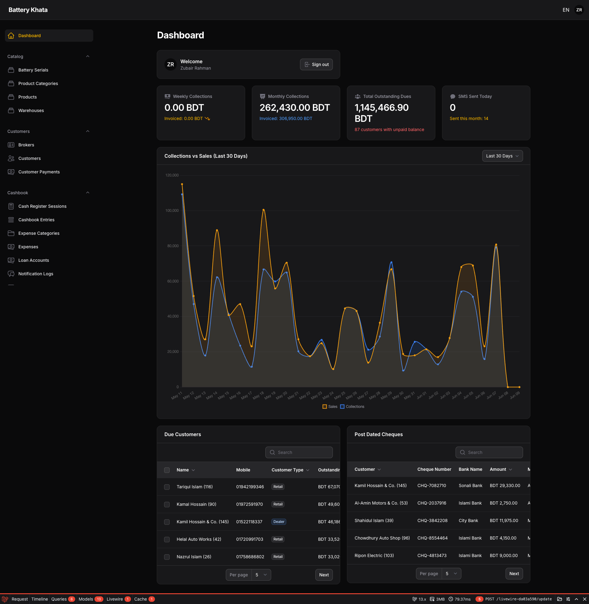

# ⚡ Battery Khata (Volt ERP)

[](https://php.net)
[](https://laravel.com)
[](https://filamentphp.com)
[](https://tailwindcss.com)
[](https://pestphp.com)

**Battery Khata (Volt ERP)** is a cashbook-centric Operational ERP and Operations Management System (OMS) custom-built for **SMB (Small & Medium Business) Battery Retailers and Wholesalers in Bangladesh**. 

Designed to move away from static CRUD patterns, this system implements event-driven business flows that model real-world battery workshop and retail floor operations, including serialized inventory, cash register sessions (*Golla*), scrap core battery trade-ins (*Bhanga Mal*), warranty buffer logistics, and staff advances (*Hawlat*).

---

## 🖥️ System Preview

Here is a preview of the premium admin dashboard panel:



---

## 🎯 Core Features & Business Modules

The application is structured into the following fully-implemented functional domains:

1. **Serialized Inventory Tracking & Transactions**
   * Every battery has an immutable physical identity (`battery_serials`) with unique serial numbers.
   * All inventory movements (Purchases, Sales, Transfers, Warranty, Returns) are logged as immutable state transitions in `inventory_transactions`.
2. **Cashbook-Centric Cash Drawer Engine (Golla / গল্লা)**
   * All register floor operations flow through terminal sessions (`cash_register_sessions`).
   * Every cash movement updates `cashbook_entries` with explicit direction (`In` / `Out`).
   * MFS (bKash/Nagad) and Bank payments go directly to accounts and are logged separately to prevent physical cash drawer discrepancy.
3. **POS & Decoupled Payment Allocation Engine**
   * Multi-step checkout wizard (Customer, Serial Selection, Scrap deductions, Payout & Broker commission).
   * Supports retail, wholesale, and set-based pricing (e.g. Easy-bike sets of 4-5 batteries, Misuk sets of 3-4 batteries).
   * Payments flow through a standalone engine and are mapped to outstanding bills via `payment_allocations`.
4. **Scrap/Core-Exchange Barter Engine (ভাঙ্গা মাল)**
   * Customers exchange old scrap batteries to offset dues or buy new stock.
   * Scrap collections are tracked in `scrap_collections` (by piece or weight) and can be disposed of back to suppliers/factories via `scrap_disposals`.
5. **Warranty Lifecycle & Buffer Stock Logistics**
   * Workflow state machine: `Received` ➔ `SentToSupplier` ➔ `Approved`/`Rejected` ➔ `Resolved`.
   * Temporary fallback batteries issued to clients are logged in `buffer_battery_issues` to ensure active stock never disappears.
6. **Micro-Loans, Staff Advances (Hawlat) & Invariant Ledgers**
   * Supports short-term Supplier/Customer trade payables, long-term capital injections, and Staff advances (`loan_accounts`).
   * Enforces an immutable chronological `running_balance` in customer and supplier ledgers for sub-second dashboard rendering.
7. **Post-Dated Cheques (PDC) Registry**
   * Registers PDCs with transition actions (Deposit, Clear, Bounce).
8. **Role-Based UI & Access Control Security**
   * **Admin / Manager**: Unrestricted access.
   * **Counter Boy**: Restrictive read-only access on supplier/purchase history; own-record-only scope on cash register sessions; blocked from deleting records or viewing loans.

---

## 📐 Key Mathematical Formulas & Business Rules

### A. Cash Session End Reconciliation
$$\text{Expected Closing Cash} = \text{Opening Cash} + \sum(\text{Inflow Cash Entries}) - \sum(\text{Outflow Cash Entries})$$
Any physical cash variation is saved as:
$$\text{Shortage/Excess} = \text{Closing Cash} - \text{Expected Cash}$$

### B. Customer Credit Exposure Derivation
Before approving an invoice or a part-credit transaction, the client's risk exposure is evaluated against their credit limit:
$$\text{Current Exposure} = \text{Latest customer\_ledgers::running\_balance}$$
The transaction is blocked if:
$$\text{Current Exposure} > \text{customers.credit\_limit}$$

---

## 🛠️ Tech Stack & Architecture

* **Backend Framework**: [Laravel 13](https://laravel.com) (PHP 8.5)
* **Admin Panel**: [Filament v5](https://filamentphp.com) & [Livewire v4](https://livewire.laravel.com)
* **Styling**: [Tailwind CSS v4](https://tailwindcss.com) (using vanilla modern HSL palettes)
* **Database**: PostgreSQL (supporting `pg_trgm` fuzzy searching & GIN indexes)
* **Testing**: [Pest PHP v4](https://pestphp.com)
* **Backups**: Spatie Laravel Backup (configured to clean and run daily database dumps at 01:00 and 02:00)

---

## 🚀 Getting Started

### 📋 Prerequisites
* PHP 8.5+
* Composer
* Node.js 22+ & NPM
* PostgreSQL
* [Laravel Herd](https://herd.laravel.com/) (recommended for local macOS serving)

### ⚙️ Installation & Setup

1. **Clone the Repository**
   ```bash
   git clone https://github.com/EshrakRahman/battery-khata.git
   cd battery-erp
   ```

2. **Run the Setup Script**
   The project has a built-in setup composer command that installs dependencies, sets up `.env`, generates app keys, runs database migrations, and compiles assets:
   ```bash
   composer run setup
   ```

3. **Seed the Database**
   To populate the system with test users, warehouses, and seed data, run:
   ```bash
   php artisan db:seed
   ```

4. **Serve the Application**
   * If using Laravel Herd, the application is automatically served at:
     ```
     http://battery-erp.test/admin
     ```
   * If running manually:
     ```bash
     composer run dev
     ```

### 🔑 Seeded Accounts (Quick Login)
For local testing and verification, the login page contains a **Quick Login Helper** panel. You can also sign in manually using the following credentials (password is `password` for all):

| Role | Email | Purpose |
| :--- | :--- | :--- |
| **Admin (Owner)** | `admin@test.com` | Unrestricted panel access |
| **Manager** | `manager@test.com` | Unrestricted panel access |
| **Counter Boy** | `counterboy@test.com` | Restrictive front-desk operations |

---

## 🧪 Testing & Code Styling

### Running Tests
Every core feature, relationship, and policy in this project is test-driven. Run the full test suite using:
```bash
php artisan test --compact
```

### Code Formatting
This project uses **Laravel Pint** to enforce clean PHP styling. Before committing any changes, run the Pint formatter:
```bash
vendor/bin/pint --dirty --format agent
```

---

## 🧑‍💻 Developer Guidelines

To maintain codebase health, please follow these guidelines during development:
* **Always do TDD**: Write or update Pest tests in `tests/Feature/Filament/` alongside any new Filament component.
* **Separation of Concerns**: Keep components clean by placing form schemas in `Schemas/` and table layouts in `Tables/` subfolders within their respective resource directory.
* **Translations**: Wrap all user-visible UI text in `__('...')` helpers and add the Bangla equivalent translations to `lang/bn.json`.
* **Soft Deletes**: Use soft deletes on core user entities and all financial documents (`invoices`, `payments`, `scrap_collections`, `supplier_payments`). Never use cascade deletes on core records.
